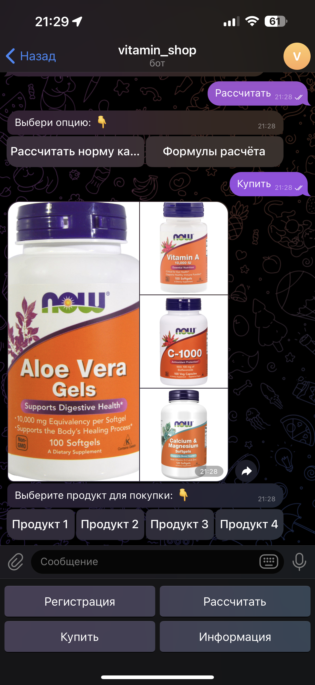

# Vitamin Bot - Telegram-бот для расчета калорий и покупки продуктов

## ➡️ О проекте
Этот проект представляет собой Telegram-бота, разработанного для помощи пользователям в расчете суточной нормы калорий и предоставления информации о продуктах, которые можно приобрести. Бот использует библиотеку `aiogram` для взаимодействия с пользователями через Telegram.

## ➡️ Основные функции
- **Регистрация:** Пользователь может зарегистрироваться, указав имя, email и возраст.
- **Расчет калорий:** Бот рассчитывает суточную норму калорий на основе возраста, роста, веса и пола пользователя.
- **Покупка продуктов:** Пользователь может просмотреть список доступных продуктов и выбрать один для покупки.
- **Информация:** Бот предоставляет информацию о формуле расчета калорий и о разработчике.

## ➡️ Установка и запуск
### ❗ Требования
- Python 3.9
- aiogram 2.x
- python-decouple 3.x
- SQLite (встроенная база данных)

### 💻 Установка зависимостей


1. Клонируйте репозиторий:
   ```bash
   git clone https://github.com/Ninja2EatYa/vitamin_bot
   cd vitamin_bot
   ```
2. Создайте виртуальное окружение и активируйте его:
   ```bash
   python -m venv venv
   source venv/bin/activate  # Для Linux/MacOS
   venv\Scripts\activate  # Для Windows
   ```
3. Установите зависимости:
   ```bash
   pip install -r requirements.txt
   ```
4. Создайте файл .env в корневой директории проекта и добавьте в него токен вашего бота:
   ```bash
   TOKEN=your_telegram_bot_token
   ```
5. Запустите бота:
   ```bash
   python vitamin_bot.py
   ```
## ➡️ Структура проекта
   ```bash
  vitamin_bot/
  ├── db/
  │   ├── crud_functions.py  # Функции для работы с базой данных
  │   ├── Products.db        # Файл базы данных продуктов
  │   └── Users.db           # Файл базы данных пользователей
  ├── pics/                  # Папка с изображениями продуктов
  │   ├── 1.jpg
  │   ├── 2.jpg
  │   ├── 3.jpg
  │   └── 4.jpg
  ├── .env                   # Файл с конфиденциальными данными
  ├── .gitignore
  ├── requirements.txt       # Список зависимостей
  ├── vitamin_bot.py         # Основной файл бота
  └── README.md              # Файл описания
   ```
## 🔒 Использование библиотеки python-decouple
1. Установите библиотеку python-decouple:
   ```bash
   pip install python-decouple
   ```
2. Создайте файл .env в корневой директории проекта и добавьте в него токен бота:
   ```bash
   TOKEN='your_telegram_bot_token'
   ```
3. Импортируйте метод config в файле vitamin_bot.py и используйте его для загрузки данных из .env:
   ```python
   from decouple import config
   
   TOKEN = config('TOKEN')
   ```
### Основные модули
- **vitamin_bot.py**: Основной файл бота, содержащий логику взаимодействия с пользователем.
- **db/crud_functions.py**: Функции для работы с базой данных, включая регистрацию пользователей и получение списка продуктов.
- **pics/**: Папка с изображениями продуктов, которые отображаются при покупке.

## ➡️ Использование
### Регистрация
1. Запустите бота и нажмите кнопку "Регистрация".
2. Введите имя пользователя, email и возраст.
3. После успешной регистрации вы сможете использовать все функции бота.
### Расчет калорий
1. Нажмите кнопку "Рассчитать".
2. Введите свой возраст, рост и вес.
3. Бот рассчитает и отправит вам суточную норму калорий.
### Покупка продуктов
1. Нажмите кнопку "Купить".
2. Выберите продукт из списка.
3. Бот подтвердит покупку и предоставит информацию о продукте.
### Информация
1. Нажмите кнопку "Информация", чтобы получить информацию о формуле расчета калорий и о разработчике.

## ➡️ Вклад
Если вы хотите внести свой вклад в проект, пожалуйста, сделайте форк репозитория и отправьте pull request с вашими изменениями.

## ➡️ Контакты
❓ Если у вас есть вопросы или предложения, пожалуйста, свяжитесь со мной по адресу 💌 777jamesholden@gmail.com

# Спасибо за использование этого проекта! 🍪
[](https://github.com/Ninja2EatYa)